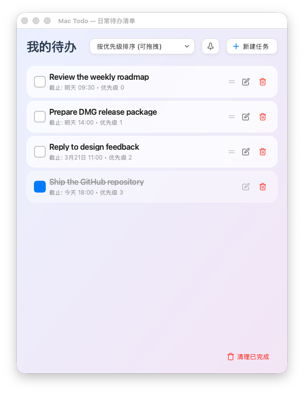

# MacTodo

MacTodo 是一个面向 macOS 的本地待办事项应用，使用 PyQt6 构建界面，数据保存在本机 JSON 文件中，不依赖云服务。

它适合想要一个轻量、直接、打开就能记任务的桌面工具的用户：支持快速新增、编辑、完成、删除、按优先级排序、按日期查看，以及通过全局热键快速呼出窗口。

## Overview

- 平台: macOS
- 界面框架: PyQt6
- 数据存储: 本地 JSON
- 分发形式: `.app` / `.dmg`
- 交互特性: 系统托盘、全局热键、拖拽排序

## Highlights

- macOS 原生桌面使用场景
- 本地 JSON 存储，不依赖账号系统
- glassmorphism 风格界面
- 支持任务新增、编辑、删除、完成
- 支持按优先级排序与拖拽重排
- 支持按截止日期排序
- 支持系统托盘常驻
- 支持全局热键 `Cmd + Option + T`
- 支持窗口置顶
- 支持打包为 `.app` 和 `.dmg`

## Preview



主界面展示了按优先级排序的任务列表、拖拽手柄、编辑与删除操作，以及置顶按钮和快速新建入口。

## Tech Stack

- Python 3
- PyQt6
- pynput
- PyInstaller

## Project Structure

- `app.py`: 当前主应用入口与 PyQt6 UI
- `todo_manager.py`: 待办数据读写与排序逻辑
- `create_assets.py`: SVG 图标生成脚本
- `build_mac.sh`: 构建 `.app`
- `build_dmg.sh`: 构建 `.dmg`
- `MacTodo.spec`: PyInstaller 配置

## Run Locally

安装依赖：

```bash
./venv/bin/pip install -r requirements.txt
```

启动应用：

```bash
./venv/bin/python app.py
```

## Usage

- 点击右上角“新建任务”添加待办
- 使用复选框标记任务完成状态
- 在“按优先级排序”模式下可直接拖拽重排
- 切换到“按截止日期排序”可快速查看最近任务
- 使用 `Cmd + Option + T` 可快速显示或隐藏窗口
- 托盘图标支持显示/隐藏与退出应用

## Build

构建 macOS 应用：

```bash
./build_mac.sh
```

构建 DMG 安装包：

```bash
./build_dmg.sh
```

## Distribution

如果你想把它发给其他人使用，推荐流程是：

1. 运行 `./build_mac.sh`
2. 确认生成 `dist/MacTodo.app`
3. 再运行 `./build_dmg.sh`
4. 分发生成的 `dist/MacTodo.dmg`

## Data Storage

应用默认将数据保存到：

```text
~/.mac_todo_data.json
```

这意味着：

- 数据保存在本机
- 删除应用不会自动删除该数据文件
- 可以手动备份这个文件来迁移任务数据

## Permissions

如果你要使用全局热键功能，macOS 可能会要求你为应用授予辅助功能或输入监听相关权限。这是系统层面的正常提示。

如果后续需要补仓库截图，macOS 还可能要求授予终端或相关工具“屏幕录制”权限。

## Notes For Developers

- 当前主线实现是 `app.py` + `todo_manager.py`
- `main.py` 和 `gui.py` 是较早期的 Tk/customtkinter 版本，现阶段保留作参考，不是当前主入口
- 打包脚本已统一走 `MacTodo.spec`

如果你只想做语法检查，可以使用：

```bash
./venv/bin/python - <<'PY'
import ast
from pathlib import Path

files = ['app.py', 'todo_manager.py', 'gui.py', 'main.py', 'create_assets.py']
for file in files:
    ast.parse(Path(file).read_text(encoding='utf-8'), filename=file)
print('AST syntax check passed')
PY
```

## Roadmap

- 补充应用截图与安装说明
- 增加基础测试
- 优化发布流程
- 完善签名与公证

## License

当前仓库暂未添加 License 文件。如需开源分发，建议补充合适的许可证。
